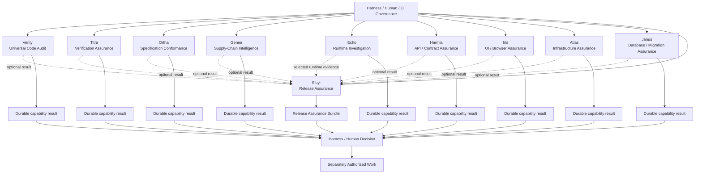
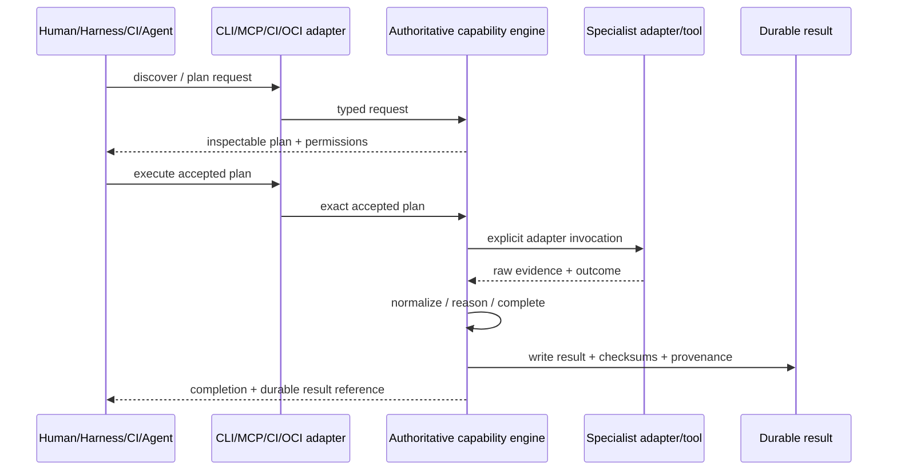

# Standalone Capability Family Architecture

**Authority:** Reference architecture governed by family invariants  
**Status:** `ACCEPTED` outer shape; shared manifest/envelope/classes remain `PROVISIONAL`

## 1. Conceptual family



The diagram shows possible evidence flow, not mandatory dependencies.

The character identity is the user-facing specialist identity. Descriptive capability names and IDs remain explicit in technical contracts, and neither form grants authority.

### 1.1 Portfolio ownership planes

```text
Plectarium suite product
    cohesive catalog, compatibility view, runner coordination,
    optional control plane, suite bill of materials

Standalone Capability Family
    family_id, charter, invariants, character registry,
    provisional shared contracts, seeds, relationship graphs

Independent capability repositories
    one domain engine and its payloads, interfaces, evaluation,
    security model, versions, releases, and durable results

Harnesses, including Octon
    trust, invocation governance, project meaning, downstream authority
```

Plectarium is part of the Octon ecosystem, not prefixed with “Octon” as its
formal name and not dependent on Octon at runtime. These planes exchange
versioned contracts and immutable references; they do not share mutable domain
tables or import sibling engines in process.

## 2. Reference outer shape

```text
Standalone Capability
│
├── Domain Engine
├── Application Services
│   ├── discover
│   ├── plan
│   ├── execute / analyze
│   ├── inspect
│   ├── compare
│   ├── report
│   └── doctor
├── Canonical CLI
├── Durable Result Contract
├── Capability Manifest
├── Evidence / Completion Model
├── Specialist Adapters
├── Agent Skill
├── MCP Interface
├── CI Interface
├── OCI / Container Packaging
├── Harness Provider Adapter
└── Future HTTP / Service Interface
```

This is a reference architecture. A capability MAY omit an operation that is not meaningful, combine application services internally, or use domain-specific terminology. It MUST preserve one authoritative semantic engine and the family authority/security invariants.

## 3. Shared versus capability-specific

### Shared or likely shared

- independent product/version lifecycle;
- discoverable identity and operations;
- inspectable planning for material effects;
- permission declarations;
- truthful top-level completion;
- durable result identity, checksums, producer identity, and provenance;
- thin CLI/CI/MCP/OCI/skill/harness interfaces;
- imported-result provenance preservation;
- no implicit project authority.

### Capability-specific by design

- claim/candidate/finding/conclusion models;
- evidence taxonomy refinements;
- graph models;
- analysis algorithms;
- prioritization;
- bundle payload internals;
- language/runtime/platform support;
- execution environment;
- external providers;
- completion substatus;
- domain terminology and presentation.

## 4. Interface flow



The Agent Skill is not shown as an engine participant because it teaches the agent how to use the interface; it does not own the semantics.

## 5. Cross-capability consumption

A consuming capability SHOULD reference an immutable upstream result instead of linking to the upstream engine in process. It MUST preserve:

- source family ID, capability ID, and version;
- result and schema version;
- subject identity and scope;
- completion state;
- evidence class and producer;
- provenance and checksums;
- limitations, freshness, and compatibility status.

The consumer MAY derive new evidence, but derived evidence must cite the upstream source and remain distinguishable.

The identity tuple is namespaced as
`(family_id, capability_id, capability_version)`. For this family,
`family_id` is exactly `standalone-capability-family`. Transport, repository,
character, or Plectarium catalog names MUST NOT substitute for that tuple.

## 6. Octon Mini boundary

Octon Mini may discover, trust, plan, authorize, invoke, validate, and route capability results. Capability cores do not import Octon types or require Octon state. Octon stores durable result references where sufficient and enters any downstream work through its normal task/decision lifecycle.

## 7. UCA as reference implementation

UCA demonstrates the full outer shape and is the first source of provisional conventions. Verification Assurance and Specification Conformance are deliberately next because they stress execution evidence, claims, aggregation, traceability, and source-authority conflicts that UCA does not fully exercise. Only after three products should the family consider stabilizing a shared specification or SDK.

## 8. Downstream packet provenance

A generated capability build packet MUST record the published family Git
commit, packet version, SHA-256 of `PACKET-MANIFEST.json`, and exact seed paths
used. These pins establish reproducible input identity only. They do not imply
that a packet, capability, Plectarium, or harness trusts or authorizes another.
