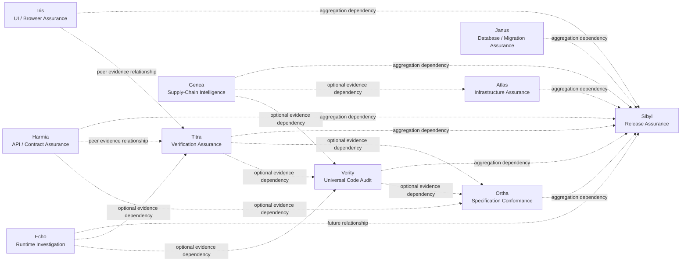

# Capability Relationship Graph

**Authority:** Family relationship model  
**Status:** `ACCEPTED` relationships; most are optional evidence or aggregation, not runtime dependencies  
**Machine-readable source:** `capability-relationship-graph.yaml`

<!-- Generated by scripts/render-projections.py; edit capability-relationship-graph.yaml. -->

| From | To | Relationship | Meaning |
| --- | --- | --- | --- |
| runtime-investigation | universal-code-audit | optional_evidence_dependency | Runtime observations may validate or contradict static performance/reliability candidates. |
| supply-chain-intelligence | universal-code-audit | optional_evidence_dependency | Dependency and provenance evidence may enrich UCA dependency-health findings. |
| verification-assurance | universal-code-audit | optional_evidence_dependency | Verification evidence may validate recommended changes and candidate correctness concerns. |
| universal-code-audit | specification-conformance | optional_evidence_dependency | Architecture and implementation observations may support conformance mappings. |
| verification-assurance | specification-conformance | optional_evidence_dependency | Verification results support requirement satisfaction claims. |
| api-contract-assurance | specification-conformance | optional_evidence_dependency | Contract compatibility evidence may satisfy interface requirements. |
| api-contract-assurance | verification-assurance | peer_evidence_relationship | Contract tests may be part of a verification portfolio; results retain source identity. |
| ui-browser-assurance | verification-assurance | peer_evidence_relationship | UI journey results may verify user-facing claims. |
| runtime-investigation | verification-assurance | optional_evidence_dependency | Runtime observations can verify performance, resource, and failure-behavior claims. |
| supply-chain-intelligence | infrastructure-assurance | optional_evidence_dependency | Container/base-image and provenance evidence may enrich infrastructure assessment. |
| universal-code-audit | release-assurance | aggregation_dependency | Release policy may require a compatible UCA result. |
| verification-assurance | release-assurance | aggregation_dependency | Release policy commonly requires claim-centered verification. |
| specification-conformance | release-assurance | aggregation_dependency | Release policy may require conformance evidence. |
| supply-chain-intelligence | release-assurance | aggregation_dependency | Release policy may require SBOM, vulnerability, license, signature, and provenance evidence. |
| api-contract-assurance | release-assurance | aggregation_dependency | Interface compatibility may be a release criterion. |
| ui-browser-assurance | release-assurance | aggregation_dependency | UI journeys/accessibility/performance may be release criteria. |
| database-migration-assurance | release-assurance | aggregation_dependency | Migration safety may be a release criterion. |
| infrastructure-assurance | release-assurance | aggregation_dependency | Infrastructure plan risk may be a release criterion. |
| runtime-investigation | release-assurance | future_relationship | Selected runtime budgets or incident follow-ups may be release evidence. |

## Constraints

- No circular hard dependencies.
- No edge grants authority.
- Imported evidence preserves provenance and completion.
