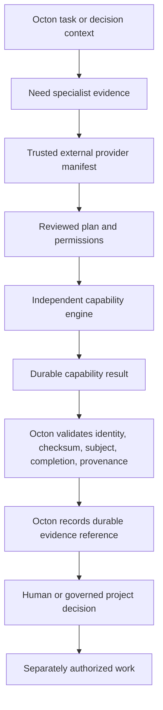

# Octon Mini Integration Boundary

**Authority:** Established family boundary; exact provider schemas remain provisional

> **Octon Mini governs whether and how a capability may operate. The capability determines domain-specific evidence. Octon determines what that evidence means for project work.**



## Octon owns

- provider trust/adoption;
- task-scoped invocation authority;
- project policy and permission acceptance;
- provider-run receipts and resumability;
- evidence routing and freshness policy;
- decisions, waivers, tasks, handoff, and downstream authorization.

## Capability owns

- domain request/plan semantics;
- adapters/providers and specialist analysis;
- evidence and conclusion semantics;
- completion;
- durable result and inspection.

## Provider classes

`read_only_evidence_producer`, `execution_evidence_producer`, `controlled_environment_evidence_producer`, and `evidence_aggregator` are provisional descriptions. Octon should still authorize exact permissions rather than trust a class label.

## Example routes

```text
Need code-health evidence?          → Verity (Universal Code Audit)
Need implementation proof?         → Titra (Verification Assurance)
Need spec/design compliance?        → Ortha (Specification Conformance)
Need dependency/provenance risk?    → Genea (Supply-Chain Intelligence)
Need runtime diagnosis?             → Echo (Runtime Investigation)
Need interface compatibility?       → Harmia (API / Contract Assurance)
Need browser/UI proof?              → Iris (UI / Browser Assurance)
Need infrastructure-plan risk?      → Atlas (Infrastructure Assurance)
Need migration safety evidence?     → Janus (Database / Migration Assurance)
Need release-readiness evidence?    → Sibyl (Release Assurance)
```

Octon may display and route on canonical character identities, but it validates descriptive capability IDs and versions in machine contracts. Character display names do not alter trust, permissions, or authority.

## Durable references

Octon SHOULD store a validated result reference containing capability ID/version/artifact digest, request/plan identity, subject/scope, result ID/schema/checksum/location, completion, freshness, provenance, and limitations. It should not copy every domain finding into the kernel as new canonical truth when a durable reference suffices.

## Authority examples

- `ready` does not authorize publish or deploy;
- `safe_within_declared_conditions` does not authorize a database migration;
- `coherent` does not authorize infrastructure apply;
- `proven_within_scope` does not authorize code changes;
- a UCA P0 finding does not authorize remediation.

## Independence test

Every capability must remain usable if Octon Mini disappears. Octon must remain functional if a capability is absent, untrusted, replaced, unavailable, or returns a partial result.
