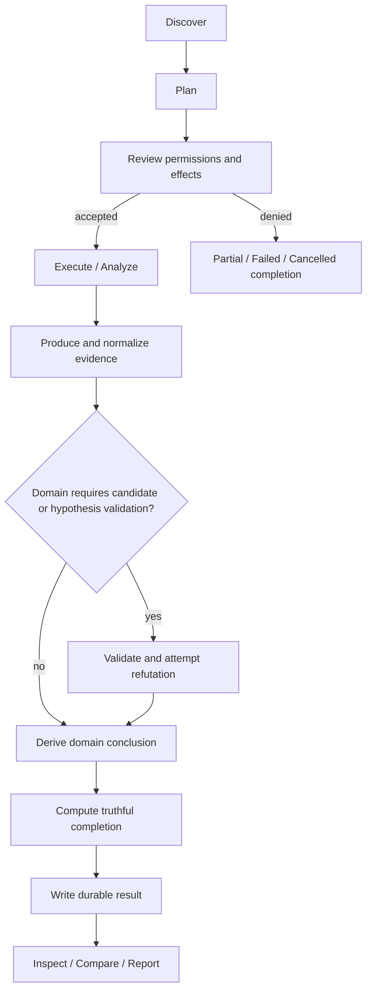

# Shared Lifecycle Convention

**Status:** `PROVISIONAL` reference lifecycle; capability constitutions may refine terminology and optional stages.

## Required semantic stages

1. **Discover:** identify capability/version/operations/providers/depth/requirements without performing material analysis.
2. **Plan:** bind subject, scope, tools/providers, permissions, resources, outputs, cache/reuse, and expected limitations.
3. **Permission review:** external authority accepts or denies the plan; capability cannot self-authorize.
4. **Execute/analyze:** perform only accepted operations under bounded effects.
5. **Evidence production:** retain raw or attributable evidence and capability-specific normalization.
6. **Reasoning:** apply claim, candidate, conformance, investigation, risk, or aggregation semantics as the domain requires.
7. **Completion:** account for every required/optional node, permission, provider, scope, freshness, and failure.
8. **Durable result:** produce checksummed, provenance-aware result identity and payload.
9. **Inspection/comparison/reporting:** provide projections without changing canonical semantics.

## Optional candidate/refutation stage

UCA, Runtime Investigation, security-style analysis, and some semantic systems benefit from candidate generation followed by validation and attempted refutation. Verification Assurance may instead begin with an explicit claim. Specification Conformance begins with obligations. Release Assurance aggregates criteria. The family does not force candidate semantics onto all domains.

## Plan stability

A material plan SHOULD have a digest. Execution that would change provider/tool versions, permissions, subject, scope, network, credentials, or output semantics requires a new plan or explicit permitted substitution rule.
